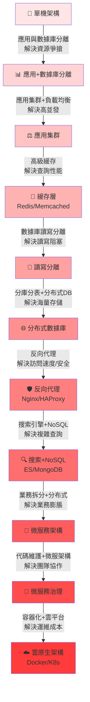
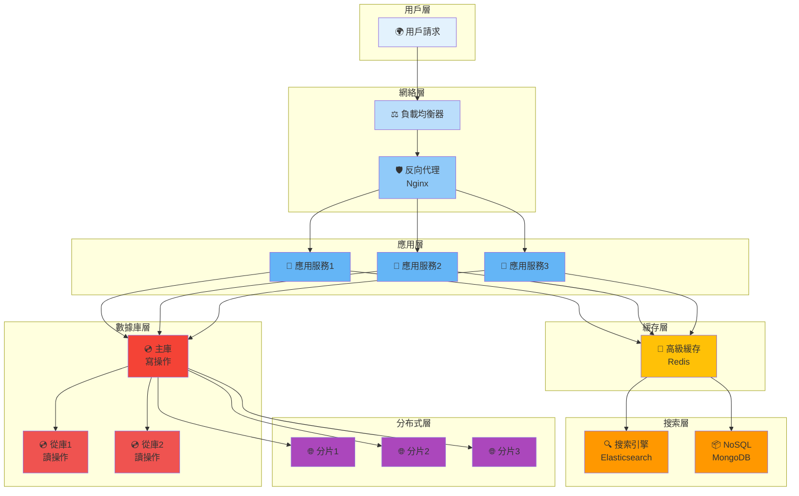
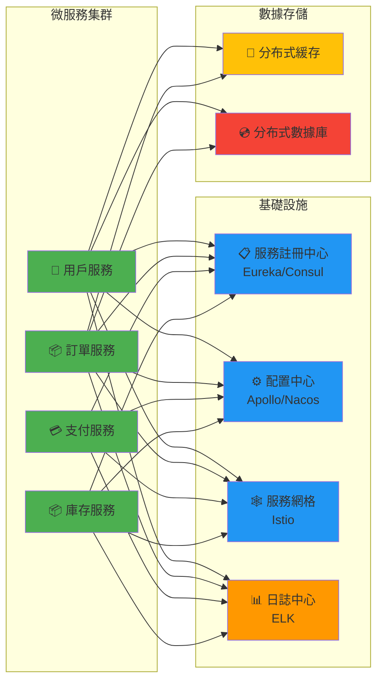
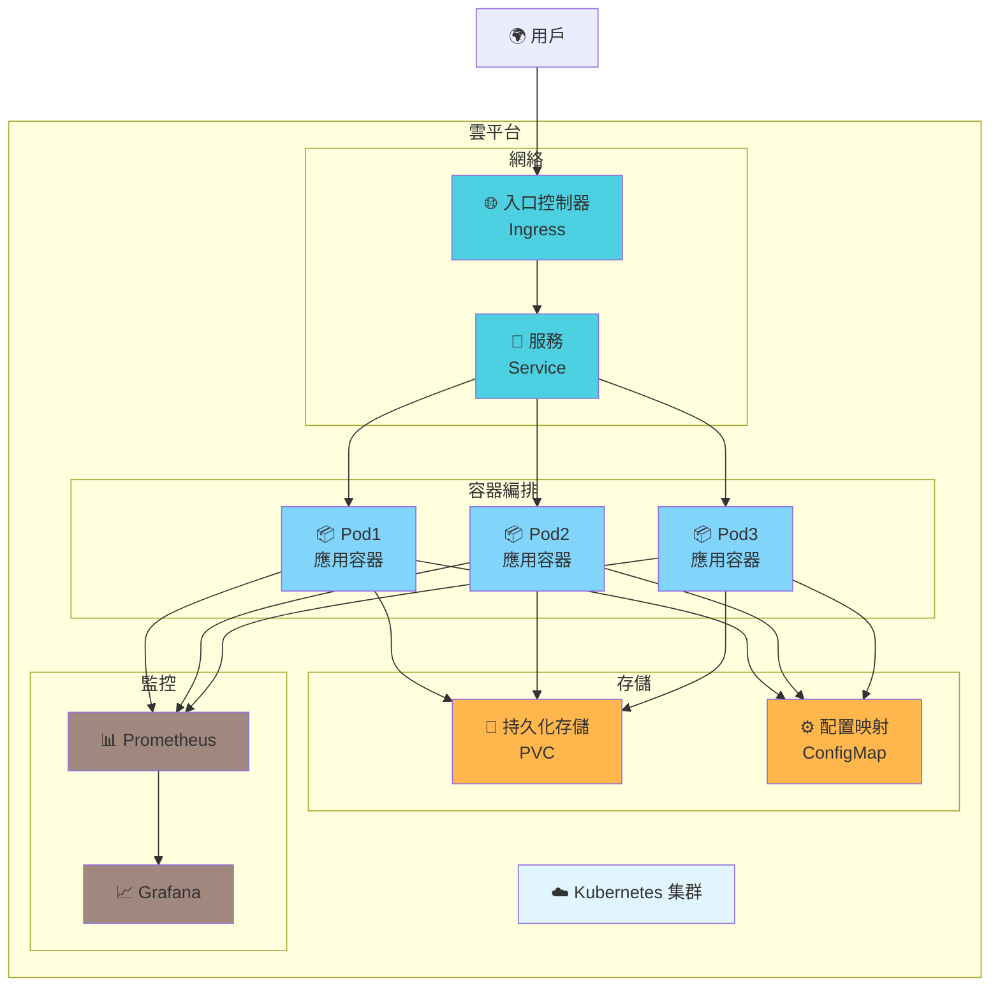

# 系統架構演進圖

## 架構演進流程

## 分層架構圖

## 問題與解決方案對應表

| 問題 | 原因 | 解決方案 | 技術選型 |
|------|------|--------|--------|
| 資源爭搶 | 應用與數據庫耦合 | 應用與數據庫分離 | 物理分離 |
| 高並發 | 單機性能瓶頸 | 應用集群+負載均衡 | Nginx/HAProxy |
| 查詢性能差 | 頻繁數據庫訪問 | 高級緩存 | Redis/Memcached |
| 讀寫阻塞 | 數據庫讀寫爭搶 | 讀寫分離 | 主從複製 |
| 海量數據存儲 | 單機存儲容量 | 分庫分表+分布式DB | Sharding/MongoDB |
| 訪問速度慢 | 距離遠/安全問題 | 反向代理 | Nginx |
| 複雜查詢 | 關係型數據庫性能 | 搜索引擎+NoSQL | ES/MongoDB |
| 業務複雜臃腫 | 單體應用膨脹 | 業務拆分+分布式 | 微服務架構 |
| 團隊協作困難 | 代碼耦合度高 | 微服務治理 | Service Mesh |
| 運維成本高 | 手動部署/擴展 | 容器化+雲平台 | Docker/K8s |

## 微服務架構示意

## 雲原生架構示意

---

## 如何使用這些圖表

### 在 GitHub 中使用
- 直接將 Mermaid 代碼複製到 `.md` 文件中
- GitHub 會自動渲染為圖表

### 在演示中使用
- 可以使用 Mermaid Live Editor: https://mermaid.live
- 或者轉換為 PNG/SVG 進行展示

### 自定義配色
修改 `fill:#XXXXXX` 部分的顏色代碼即可

